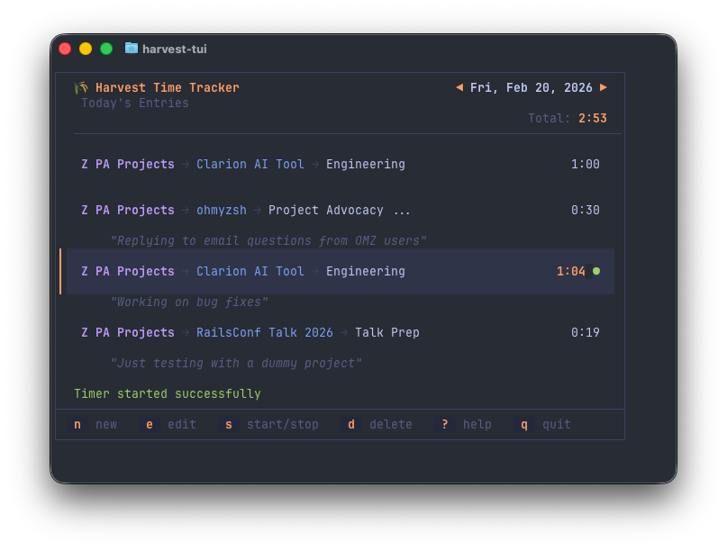
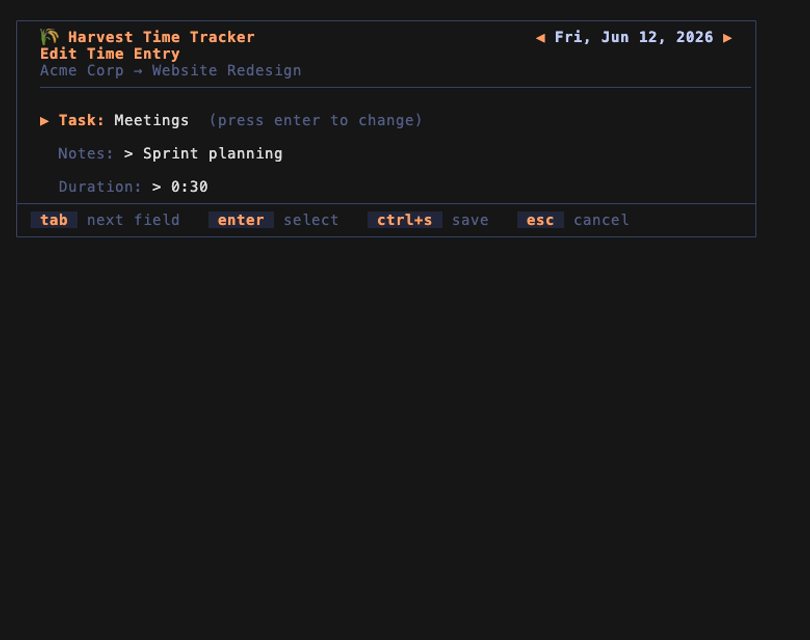
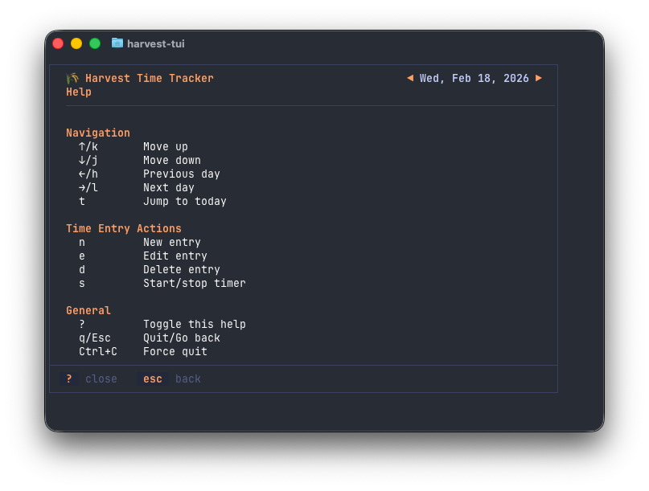

# harvest

A command-line tool for managing your Harvest time entries, projects, and tasks, built on the [Harvest API v2](https://help.getharvest.com/api-v2/). It also includes an [interactive TUI](#interactive-tui) (`harvest -ui`) for browsing and editing your timesheet from the terminal.

## Installation

### Homebrew (Recommended)

```bash
brew install --cask jc00ke/tap/harvest-cli
```

Homebrew installs shell completions automatically. To upgrade later, run
`brew upgrade --cask harvest-cli`. The installed command is still `harvest`.

### Download a Release Binary

Download the latest binary for your platform from the [Releases page](https://github.com/jc00ke/harvest/releases).

Or use curl to download directly (example for macOS Apple Silicon):

```bash
curl -sL https://github.com/jc00ke/harvest/releases/latest/download/harvest_darwin_arm64.tar.gz | tar xz
sudo mv harvest /usr/local/bin/
```

### Debian / Ubuntu (`.deb`)

Download the `.deb` for your architecture from the [Releases page](https://github.com/jc00ke/harvest/releases) and install it with `apt`:

```bash
# Example for x86_64 (use harvest_..._arm64.deb on ARM)
curl -sLO https://github.com/jc00ke/harvest/releases/latest/download/harvest_linux_amd64.deb
sudo apt install ./harvest_linux_amd64.deb
```

This installs the binary to `/usr/bin/harvest` and shell completions to the
standard system locations. To upgrade later, install the newer `.deb` the same
way; to remove it, run `sudo apt remove harvest`.

Alternatively, [`deb-get`](https://github.com/wimpysworld/deb-get) can install
the `.deb` and keep it updated from GitHub releases. `harvest` isn't in
deb-get's built-in catalog, so add a local package definition first:

```bash
sudo tee /etc/deb-get/99-local.d/harvest >/dev/null <<'EOF'
DEFVER=1
ARCHS_SUPPORTED="amd64 arm64"
get_github_releases "jc00ke/harvest" "latest"
if [ "${ACTION}" != prettylist ]; then
    URL=$(grep -m 1 "browser_download_url.*_linux_${HOST_ARCH}\.deb\"" "${CACHE_FILE}" | cut -d'"' -f4)
    VERSION_PUBLISHED=$(grep -oP 'download/v\K[^/]+' <<< "${URL}")
fi
PRETTY_NAME="harvest"
WEBSITE="https://github.com/jc00ke/harvest"
SUMMARY="A command-line tool for managing your Harvest time entries, projects, and tasks"
EOF

deb-get update
deb-get install harvest
```

### Verifying a Release

Release artifacts are signed two ways, both backed by [Sigstore](https://www.sigstore.dev/):

- **Build provenance** — every archive carries a GitHub attestation tying it to
  the workflow run that built it.
- **Signed checksums** — `checksums.txt` is keyless-signed with
  [cosign](https://github.com/sigstore/cosign), with the signature and
  certificate published together as `checksums.txt.bundle`.

Verify an archive's provenance with the [GitHub CLI](https://cli.github.com/)
(no extra tooling required):

```bash
gh attestation verify harvest_darwin_arm64.tar.gz -R jc00ke/harvest
```

Verify the signed checksums with cosign, then check your download against them:

```bash
# Download the checksums and their signature bundle (e.g. for v0.4.1)
gh release download v0.4.1 -R jc00ke/harvest -p 'checksums.txt' -p 'checksums.txt.bundle'

# Confirm the checksums were signed by this repo's release workflow
cosign verify-blob \
  --bundle checksums.txt.bundle \
  --certificate-identity-regexp '^https://github.com/jc00ke/harvest/.github/workflows/release.yml@' \
  --certificate-oidc-issuer https://token.actions.githubusercontent.com \
  checksums.txt

# Confirm your downloaded archive matches the verified checksums
sha256sum --ignore-missing -c checksums.txt
```

If you have the repo checked out, `mise run release:verify v0.4.1` runs all of
the above against a published release in one step.

### Install with Go

```bash
go install github.com/jc00ke/harvest/cmd/harvest@latest
```

The binary is installed to `~/go/bin`. If that directory isn't already on your `$PATH`, add it:

```bash
export PATH="$HOME/go/bin:$PATH"
```

Otherwise, you can run it directly with `~/go/bin/harvest`.

### Build from Source

1. Clone this repository:

   ```bash
   git clone https://github.com/jc00ke/harvest.git
   cd harvest
   ```

2. Build the application:

   ```bash
   mise run build
   ```

The binary will be created at `bin/harvest`.

## Updating

- **Homebrew:** `brew upgrade --cask harvest`.
- **Release binary:** Download the latest version from the [Releases page](https://github.com/jc00ke/harvest/releases) and replace the existing binary.
- **Go install:** Run `go install github.com/jc00ke/harvest/cmd/harvest@latest` again.
- **Build from source:** Pull the latest changes and rebuild:

  ```bash
  git pull
  mise run build
  ```

### Shell Completions

`harvest completion <shell>` prints a completion script that completes subcommands and flags
by calling back into the binary, so it always matches the installed version.
Release archives also ship the scripts in a `completions/` directory.

#### fish

```fish
harvest completion fish > ~/.config/fish/completions/harvest.fish
```

Completions are available in new fish sessions immediately.

#### bash

Requires the [bash-completion](https://github.com/scop/bash-completion) package (v2).

```bash
# Linux, current user only
mkdir -p ~/.local/share/bash-completion/completions
harvest completion bash > ~/.local/share/bash-completion/completions/harvest

# Linux, all users
harvest completion bash | sudo tee /etc/bash_completion.d/harvest > /dev/null

# macOS with Homebrew's bash-completion@2
harvest completion bash > "$(brew --prefix)/etc/bash_completion.d/harvest"
```

Open a new shell to pick up the completions.

#### zsh

```zsh
# Place the script in any directory on your $fpath, e.g.
harvest completion zsh > "${fpath[1]}/_harvest"

# or with Homebrew
harvest completion zsh > "$(brew --prefix)/share/zsh/site-functions/_harvest"
```

If completions aren't already enabled in your shell, also add `autoload -U compinit; compinit` to your `~/.zshrc`. Then open a new shell.

PowerShell is also supported; run `harvest completion powershell --help` for details.

## Configuration

### Getting Harvest API Credentials

1. Log into your Harvest account
2. Go to Settings → Integrations → Developers
3. Create a new Personal Access Token
4. Note your Account ID and Access Token

### Storing Credentials

Store your credentials in the OS keyring:

```bash
harvest auth login
```

You'll be prompted for your Account ID and Access Token. Use `harvest auth status` to verify, and `harvest auth logout` to remove them.

## Usage

### CLI

```bash
harvest entries list              # list time entries for a date (defaults to today)
harvest entries list --date 2026-06-08 --week   # a 7-day window starting at --date
harvest entries list --summary    # aggregate the week per client per day
harvest entries create            # log time
harvest entries start             # start the timer on an existing entry
harvest entries stop              # stop a running timer
harvest entries edit              # edit an existing entry
harvest entries delete            # delete an entry
harvest projects                  # list projects and their tasks
harvest me                        # show the authenticated user
```

Every command accepts `--json` to output results as JSON instead of a table, which makes the CLI easy to script with tools like `jq`:

```bash
harvest --json entries list | jq '.[].hours'
```

Run `harvest --help` or `harvest <command> --help` for full details.

## Interactive TUI

Launch the TUI to browse and edit your timesheet interactively:

```bash
harvest -ui
```

To try it without a Harvest account, run it in demo mode, which uses
built-in sample data and requires no credentials:

```bash
harvest -ui --demo
```

### Time Sheet view



### Add/Edit Time Entry



### Help Menu



### Keybindings

#### Navigation

| Key | Action |
|-----|--------|
| `↑` / `k` | Move selection up |
| `↓` / `j` | Move selection down |
| `←` / `h` | Previous day |
| `→` / `l` | Next day |
| `t` | Jump to today |

#### Time Entry Actions

| Key | Action |
|-----|--------|
| `n` | Create new time entry |
| `e` | Edit selected entry |
| `d` | Delete selected entry |
| `s` | Start/stop timer on selected entry |

#### General

| Key | Action |
|-----|--------|
| `?` | Toggle help overlay |
| `q` / `Esc` | Quit / go back |
| `Ctrl+C` | Force quit |

## Development

### Running Tests

```bash
mise run test
```

### Building Locally

```bash
mise run build
```

### Full Check (Format, Lint, Test)

```bash
mise run check
```

### Regenerating Screenshots

The README screenshots are captured by [VHS](https://github.com/charmbracelet/vhs)
driving the TUI in demo mode (see `demo.tape`):

```bash
mise run screenshots
```

mise provides `vhs` and `ffmpeg`; install `ttyd` separately (`brew install ttyd` on macOS).

### Releases

```bash
mise run release v0.1.0
```

Releases are signed with build provenance attestations and a cosign-signed
checksums file; see [Verifying a Release](#verifying-a-release) for how to
check them.

## Disclaimer

[Harvest](https://www.getharvest.com/) is a registered trademark of [Bending Spoons US Inc](https://bendingspoons.com/).
This project has no direct affiliation with Harvest or Bending Spoons.
It is an independent open source project that integrates with the [Harvest API v2](https://help.getharvest.com/api-v2/).

## Credit

I forked this from [Planet Argon's harvest-tui](https://github.com/planetargon/harvest-tui).
If you need Ruby, Rails, AI Safety consulting, you should check out their [services](https://www.planetargon.com/services).

## License

This project is licensed under the [MIT License](LICENSE).
